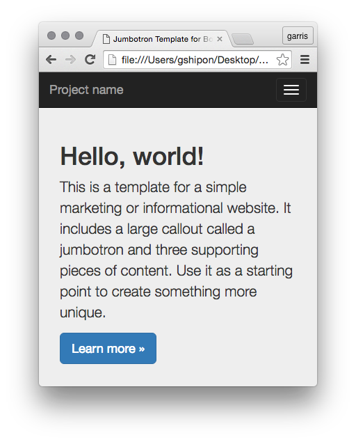
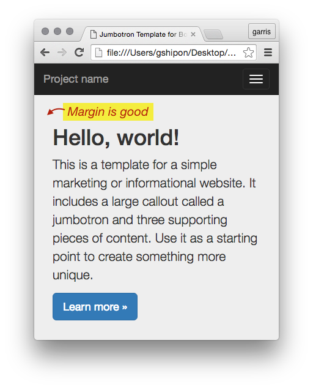
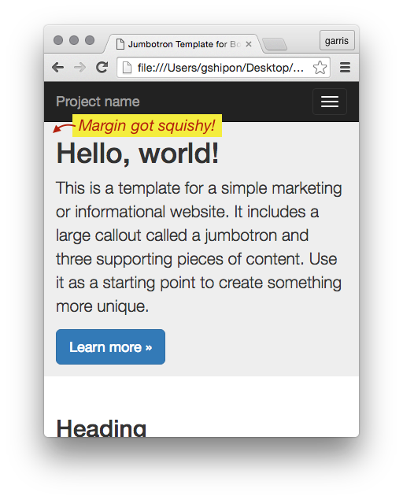
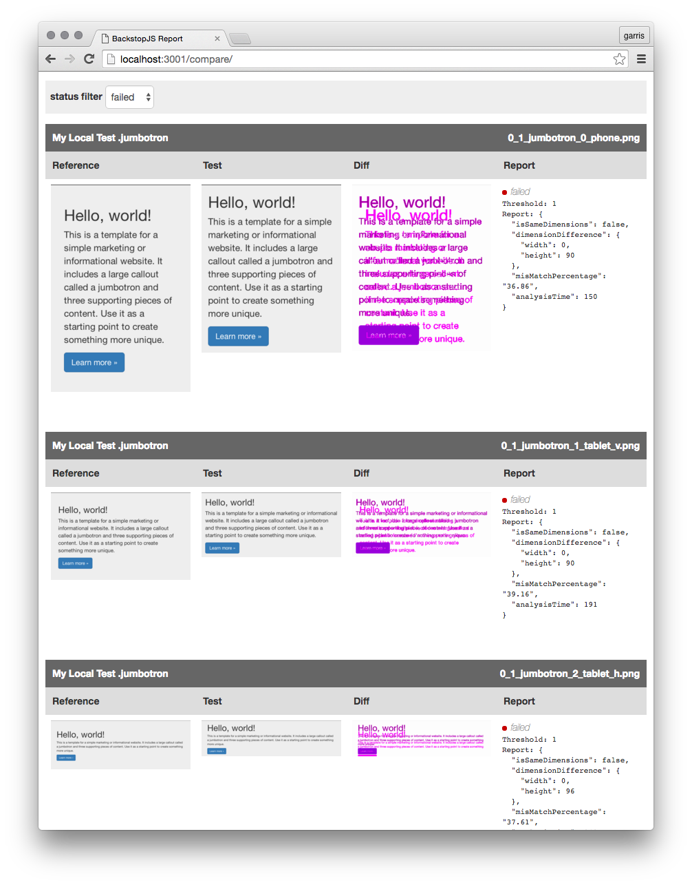

<h3>A use-case for visual regression testing</h3>

Do a search for "CSS regression testing" and a common theme becomes clear – breaking CSS is easy, testing it is hard.

This was the case at the onset of a responsive CSS refactoring project I scoped for a large online retailer. Like many other web companies at the time, we were in the process of adding responsive behavior to a massive e-commerce web app, which was originally designed for 1024px desktop screens.

I realized this would be a regression-prone job. Retrofitting multiple breakpoint behaviors meant we would likely have a lot of hard-to-find display bugs. I needed a way for our engineers to automate bug discovery _before_ slamming our QA team with hundreds of ticky-tacky little layout issues.


<h3>Where BackstopJS fits in</h3>

The solution I wanted had to play nice with web-developers, that is, it would be easy to install locally, use familiar web-dev paradigms and give a reasonable amount of confidence that a selector change made for mobile isn't going to result in a hard-to-find bug in a desktop layout.

_At the time_, there wasn't anything out of-the-box that quite fit the bill. This was the reason for creating <a href="http://backstopjs.org/">BackstopJS</a>.

BackstopJS is a visual regression testing app which wraps [CasperJS](http://casperjs.org), [PhantomJS](http://phantomjs.org) and [ResembleJS](http://huddle.github.io/Resemble.js/) in an _easy-to-configure_ test matrix across multiple app-states (URLs), DOM elements and screen sizes.

The following is a 15 minute walk-through of an installation and initial configuration of BackstopJS.


<h3>A visual regression-test tutorial</h3>

This instructional will be based on a simple demo project [download zip here](http://css-tricks.com/examples/myCoolProject.zip), which is taken directly from the Bootstrap [example page](http://getbootstrap.com/getting-started/#examples).

<h4>Expand the simple demo</h4>

Let's begin by [downloading and expanding the "myCoolProject" example project files](http://css-tricks.com/examples/myCoolProject.zip). We will install the testing framework right into this example project:


Here is what you'll see if you open up `myCoolProject/index.html` in a web browser... _Remember, it's responsive. So, make sure to resize the browser window down to see the most narrow layout!_



<h4>Install BackstopJS with NPM</h4>

_The rest of this tutorial will require the very awesome Node.js environment and it's integrated package manager NPM. If you don't have Node and NPM installed you can [get it here!](https://nodejs.org/)_

Now go to your project root, in this case `/myCoolProject/` and run...

```
$ cd ~/path-to-myProjects/myCoolProject
$ npm install backstopjs
```

Your directory should now look like this:


<strong>Install complete!</strong>

Now lets get to some basic testing...

<h4>Generating a BackstopJS configuration template</h4>

The basic configuration process is straight forward from here – to help with things, BackstopJS can generate a config file that you can modify for your project. From the `myCoolProject/node_modules/backstopjs/` directory run...

```
$ cd ~/path-to-myProjects/myCoolProject/node_modules/backstopjs/
$ npm run genConfig
```


This will add files to your project root – setting up folders for BackstopJS screenshots `backstop_data` and generating a boilerplate configuration file `backstop.json` .


 `backstop.json` This is where you'll specify your testing rules – let's look at that file...

```json
{
  "viewports": [
    {
      "name": "phone",
      "width": 320,
      "height": 480
    }, {
      "name": "tablet_v",
      "width": 568,
      "height": 1024
    }, {
      "name": "tablet_h",
      "width": 1024,
      "height": 768
    }
  ],
  "scenarios": [
    {
      "label": "My Homepage",
      "url": "http://getbootstrap.com",
      "hideSelectors": [],
      "removeSelectors": [
        "#carbonads-container"
      ],
      "selectors": [
        "header",
        "main",
        "body .bs-docs-featurette:nth-of-type(1)",
        "body .bs-docs-featurette:nth-of-type(2)",
        "footer",
        "body"
      ],
      "readyEvent": null,
      "delay": 500,
      "onReadyScript": null,
      "onBeforeScript": null
    }
  ],
  "paths": {
    "bitmaps_reference": "../../backstop_data/bitmaps_reference",
    "bitmaps_test": "../../backstop_data/bitmaps_test",
    "compare_data": "../../backstop_data/bitmaps_test/compare.json",
    "casper_scripts": "../../backstop_data/casper_scripts"
  },
  "engine": "phantomjs",
  "report": ["browser", "CLI"],
  "cliExitOnFail": false,
  "debug": false,
  "port": 3001
}
```

In this configuration you can see three <code>viewports</code> objects, one for <b>phone</b>, <b>tablet vertical</b> and <b>tablet horizontal</b>, each with name and dimensions properties. You can add as many <code>viewports</code> objects as you need. <em>BackstopJS requires at least one</em>.

Then we have <code>scenarios</code> which include the URLs and element selectors that BackstopJS will test. It's useful to think of every scenario object as a test for a specific static page or global app state. Add as many `scenarios` here as you need. <em>BackstopJS requires at least one</em>.

Inside each scenario is a list of selectors. Selectors accept standard CSS notation. For each selector you specify, BackstopJS will take a screenshot and test that area of your layout.  Your selector area could be as small as a `button` or as big as the `body` of your page -- [check the documentation for more on using this feature with dynamic web apps](https://github.com/garris/BackstopJS#dealing-with-dynamic-content).

_You may notice that in the config we just generated, our URL is pointing to http://getbootstrap.com (the homepage of the Bootstrap design component library) – that is what we would be testing if we were to run BackstopJS now. This is here to illustrate that BackstopJS can point to local <em>or</em> remote URLs so it's easy to imagine repurposing the same tests for local development, QA, staging and production environments._

<h4>Modifying the configuration template</h4>

For *our* demo, make the following change and replace the `scenarios` node in `myCoolProject/backstop.json`.

```json
"scenarios": [
    {
      "label": "My Local Test",
      "url": "../../index.html",
      "hideSelectors": [],
      "removeSelectors": [
      ],
      "selectors": [
        "nav",
        ".jumbotron",
        "body .col-md-4:nth-of-type(1)",
        "body .col-md-4:nth-of-type(2)",
        "body .col-md-4:nth-of-type(3)",
        "footer"
      ],
      "readyEvent": null,
      "delay": 0,
      "onReadyScript": null,
      "onBeforeScript": null
    }
  ],

```

<h4>Generating reference screenshots</h4>

From the `myCoolProject/node_modules/backstopjs/` directory run...

<pre><code>$ npm run reference</code></pre>

This task will create (or update an existing) screen captures representing all specified selectors at every breakpoint. When the process is complete, take a look inside `/myCoolProject/backstop_data/bitmaps_reference/`:


So far so good, we have our reference set. Now lets run a test!


<h3>Running our first test</h3>

We are about to run our first test.  **But keep in mind, we haven't changed anything in our CSS yet, so our tests should pass!**

From the `myCoolProject/node_modules/backstopjs/` directory run...

<pre><code>$ npm run test</code></pre>

This task will create a new, timestamped-directory of test images inside `/myCoolProject/backstop_data/bitmaps_test/<timestamp>/`.

Once the test images are generated, BackstopJS will open your web browser and display a report comparing the most recent test bitmaps against the current reference images. Significant differences (if any) are detected and shown.


In this instance, since we haven't made any changes to our test page, BackstopJS should show all of our tests as passing. Now, let's try changing our CSS and see what happens.

<h4>Updating our index file and running our second test</h4>

Again, here is what you'll see if you open up `myCoolProject/index.html` in a web browser – notice the margin around the text...



Now, lets mess that up! Open our test file at `myCoolProject/index.html` and inset the following code just before the closing `</head>` tag in the markup:

```
<style>
  .jumbotron {
    padding: 0px;
  }
</style>
```

And heres what our screen looks like now...



_This is exactly the kind of thing that happens all the time during web development.  Some unscoped code gets in and hoses your layout just enough that you might not notice :(_

Now, From the `myCoolProject/node_modules/backstopjs/` directory run...

```
$ npm run test
```

Our test should run again and errors should be found, scroll the report down to see a visual diff of the issues we've just created...


Our visual diff contains the reference capture, the most recent test capture and the visual diff file.



<h4>And there you have it – regression found!</h4>

This is of course, a very simple example. In real life, designers and engineers may find themselves working on very large and or complex CSS projects. That is when a system like this really improves the quality and consistency of our work. By automating the repetitive visual tasks we can confidentally pursue more creative ones.

<h4>About workflow</h4>

There are many ways to integrate this kind of test into your workflow – you could fire off tests every time you build or you could manually run tests (as you work or just before pushing to your next stage). You could even integrate BackstopJS into your CI pipeline if that's your thing.  All of these topics are outside the scope of this article – check the documentation for more info.

<h3>Next steps</h3>

Since first releasing in 2014, BackstopJS has grown substantially. There are loads of newly added features developed by the community including...

- **SPA testing support** Use casper scripts and explicit web-app triggers to ensure screenshots are captured at the correct time inside your web-app (e.g. after API responses, after CSS animation competion, or wait for any other watchable async process).
- **Simulating user interacitons** Use casper scripting inside your scenarios to simulate interacions with your on-screen components.
- **CI pipeline integration** BackstopJS CLI features have enabled advanced users to make visual regression testing a part of their continus integration process.
- **Active configuration files** Enables active (node module) logic inside your config files – change testing behaivor based on enviornment or other conditions, point to different config files to use your BackstopJS instance as a centralized test server for multiple enviornments, verticals, profiles, projects or whatever.

### You can get BackstopJS on Github
<ul>
  <li><a href="http://BackstopJS.org/">BackstopJS.org</a></li>
  <li>File bugs, get troubleshooting help, learn about advanced features and contribute <a href="https://github.com/garris/BackstopJS">on GitHub</a>!</li>
</ul>
