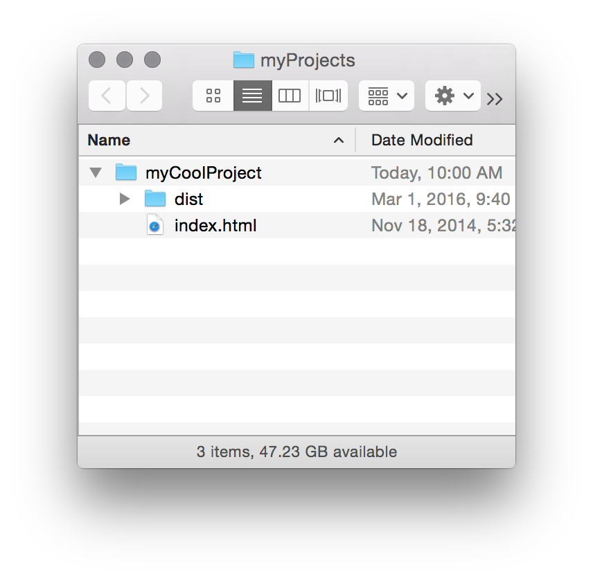

<em class="explanation">The following is a guest post by <a href="http://expanded.me/">Garris Shipon</a>. We've touched on <a href="http://css-tricks.com/automatic-css-testing/">the four types of CSS testing</a> here before. Regression testing is the hardest. It's the type where you're trying to test if a change you made to CSS resulted in any unexpected visual problems. This is made more difficult with responsive designs. Garris built a tool for doing this as he embarked upon a new responsive design for a large scale site. Here, he'll walk you through the whole thing.</em>

<!--more-->

<h3>Why CSS testing?</h3>

Do a search for CSS regression testing and a common theme becomes clear – breaking CSS is easy, testing it is hard.  This was the case at the onset of a responsive CSS refactoring project I scoped for a large online retailer.

Like many other web companies at the time, we were in the process of adding responsive behavior to a massive e-commerce web app, which was originally designed for 1024px desktop screens. 

I realized this would be a regression-prone job. Retrofitting multiple breakpoint behaviors would mean we would have a lot of hard-to-find display bugs. I needed a way for our engineers to automate bug discovery _before_ slamming our QA team with hundreds of ticky-tacky little layout issues.


<h3>CSS testing options</h3>

The solution I wanted would specifically target web-developers, would be easy to install locally, use familiar web-dev paradigms and give a reasonable amount of confidence that a selector change made for mobile isn't going to result in a hard-to-find bug in a desktop layout. 

At the time, there wasn't anything out of-the-box that quite fit the bill. This was the reason for creating <a href="http://backstopjs.org/">BackstopJS</a>. 

BackstopJS is a solution built on top of Gulp and PhantomJS which wraps <a href="http://huddle.github.io/Resemble.js/">ResembleJS</a> (written by <a href="https://github.com/jamescryer">James Cryer</a>) in an _easy-to-configure_ visual regression test matrix across multiple URLs, page elements and screen sizes.

The following is a 15 minute walk-through of an installation and initial configuration of BackstopJS.


<h3>Installation</h3>

This instructional will be based on a simple demo project [download zip here](http://css-tricks.com/examples/myCoolProject.zip), which is taken directly from the Bootstrap [example page](http://getbootstrap.com/getting-started/#examples).

<h4>Expand the simple demo</h4>

Begin by [downloading the "myCoolProject" example project files](http://css-tricks.com/examples/myCoolProject.zip) and install the testing framework right into here:



<h4>Install BackstopJS with NPM</h4>

Go to your project root, in this case: myCoolProject

```
$ cd ~/path-to-myProjects/myCoolProject
$ npm install backstopjs
```

Your directory should now look like this:


<h4>Install dependencies</h4>

So far so good, you now have BackstopJS scaffolding, but there are some super useful packages that BackstopJS requires so let's make sure we have those.

<strong>If you don't already have a global Gulp instance...</strong>

<a href="http://gulpjs.com">Gulp</a> is a system for enabling various task automation. It's great  for project building, asset minification, CSS preprocessing etc. 

```
$ sudo npm install gulp -g
```
test for a correct install with...

```
$ gulp -v
> CLI version 3.8.10
> Local version 3.8.10
```

<strong>If you don't already have a global PhantomJS install...</strong>

Well then, this is your lucky day! <a href="http://phantomjs.org/download.html">PhantomJS</a> is a headless web browser. It does everything a web browser does, except display content to the screen.

```
$ sudo npm install phantomjs
```

test for a correct install with...

```
$ phantomjs -v
> 1.9.8 
```

<strong>If you don't already have a global CasperJS install...</strong>

Then don't miss this. <a href="http://casperjs.org/">CasperJS</a> (<a href="http://docs.casperjs.org/en/latest/installation.html">installation docs</a>) does for headless web clients what jQuery did for DOM selection.

```
$ sudo npm install -g casperjs
```

test for a correct install with...

```
$ casperjs --version
> 1.1.0-beta3
```

<strong>Install complete!</strong>

If you have made it this far then you have some badass CSS regression testing ingredients. Lets try some basic testing.

<h4>Generate a BackstopJS configuration template</h4>

The basic configuration process is straight forward from here – to help with things, BackstopJS can generate a config file that you can modify for your project. From the `myCoolProject/node_modules/backstopjs/` directory:

```
$ cd ~/path-to-myProjects/myCoolProject/node_modules/backstopjs/
$ gulp genConfig
```


This will add files to your project root – setting up folders for BackstopJS screenshots and generating a boilerplate configuration file.  


 `backstop.json` This is where you'll specify your testing rules – let's look at that file...

```json
{
  "viewports": [
    {
      "name": "phone",
      "width": 320,
      "height": 480
    }, {
      "name": "tablet_v",
      "width": 568,
      "height": 1024
    }, {
      "name": "tablet_h",
      "width": 1024,
      "height": 768
    }
  ],
  "scenarios": [
    {
      "label": "My Homepage",
      "url": "http://getbootstrap.com",
      "hideSelectors": [],
      "removeSelectors": [
        "#carbonads-container"
      ],
      "selectors": [
        "header",
        "main",
        "body .bs-docs-featurette:nth-of-type(1)",
        "body .bs-docs-featurette:nth-of-type(2)",
        "footer",
        "body"
      ],
      "readyEvent": null,
      "delay": 500,
      "onReadyScript": null,
      "onBeforeScript": null
    }
  ],
  "paths": {
    "bitmaps_reference": "../../backstop_data/bitmaps_reference",
    "bitmaps_test": "../../backstop_data/bitmaps_test",
    "compare_data": "../../backstop_data/bitmaps_test/compare.json",
    "casper_scripts": "../../backstop_data/casper_scripts"
  },
  "engine": "phantomjs",
  "report": ["browser", "CLI"],
  "cliExitOnFail": false,
  "debug": false,
  "port": 3001
}
```

In this configuration you can see three <code>viewports</code> objects, one for <b>phone</b>, <b>tablet vertical</b> and <b>tablet horizontal</b>, each with name and dimensions properties. You can add as many <code>viewports</code> objects as you need. <em>BackstopJS requires at least one</em>.

Then we have <code>scenarios</code> which include the URLs and element selectors that BackstopJS will test. The selectors accept standard CSS selector notation. It's useful to think of every scenario object as a test for a specific static page or global app state. Add as many `scenarios` here as you need. <em>BackstopJS requires at least one</em>.

_You may notice that in this config, our URL is pointing to http://getbootstrap.com (the homepage of the Bootstrap design component library) – that is what we would be testing if we were to run BackstopJS now. This is here to illustrate that BackstopJS can point to local <em>or</em> remote URLs so it's easy to imagine repurposing the same tests for local development, QA, staging and production environments._

<h4>Modify the configuration template</h4>

For *our* demo, make the following change and replace the <code>scenarios</code> node in `myCoolProject/backstop.json`.

```json
"scenarios": [
    {
      "label": "My Local Test",
      "url": "../../index.html",
      "hideSelectors": [],
      "removeSelectors": [
      ],
      "selectors": [
        "nav",
        ".jumbotron",
        "body .col-md-4:nth-of-type(1)",
        "body .col-md-4:nth-of-type(2)",
        "body .col-md-4:nth-of-type(3)",
        "footer"
      ],
      "readyEvent": null,
      "delay": 0,
      "onReadyScript": null,
      "onBeforeScript": null
    }
  ],

```

<h4>generating (or updating) reference screenshots</h4>

From the `myCoolProject/node_modules/backstopjs/` directory:

<pre><code>$ gulp reference</code></pre>

This task will create (or update an existing) screen captures representing all specified selectors at every breakpoint. When the process is complete, take a look inside `/myCoolProject/backstop_data/bitmaps_reference/`:


So far so good, we have our reference set. Now lets run a test!


<h3>Running our first test</h3>

We are about to run our first test.  **But keep in mind, we haven't changed anything in our CSS yet, so our tests should pass!**

From the `myCoolProject/node_modules/backstopjs/` directory:

<pre><code>$ gulp test</code></pre>

This task will create a new, timestamped-directory of test images inside `/myCoolProject/backstop_data/bitmaps_test/<timestamp>/`.  

Once the test images are generated, BackstopJS will open your web browser and display a report comparing the most recent test bitmaps against the current reference images. Significant differences (if any) are detected and shown. 


In this instance, since we haven't made any changes to our test page, BackstopJS should show all of our tests as passing. Now, let's try changing our CSS and see what happens.

<h4>Updating our index file and running our second test</h4>

Open our test file at `myCoolProject/index.html` and inset the following code just before the closing `</head>` tag in the markup:

```
<style>
  .jumbotron {
    padding: 0px;
  }
</style>
```

Now, From the `myCoolProject/node_modules/backstopjs/` directory run...

`$ gulp test`

Our test should run again and errors should be found, scroll the report down to see a visual diff of the issues we've just created...


Our visual diff contains the reference capture, the most recent test capture and the visual diff file.

<h4>And there you have it – regression found!</h4>

This is a very simple example. In real life, designers and engineers may find themselves working on very complex responsive layouts. That is when a system like this really delivers value. By automating the repetitive tasks we can move our CSS projects forward by focusing on more complex and creative tasks that can't be automated.

Since originally releasing BackstopJS in 2014 there have been loads of new features developed by the community. Here are a list of features and capabilities that will likely be the topic of future tutorial posts...


- CLI multiple config files and is now able to be used as part of a CI pipeline
- Slimer option
- SPA web-app compatibility -- trigger screenshots when web-apps are ready (e.g. after Ajax call responses, animated transitions or after any other async process)
- Resource file locations are configureable so screenshots can be captured by your source control.


<h3>More Info</h3>

<ul>
  <li><a href="http://BackstopJS.org/">BackstopJS.org</a></li>
  <li>File bugs, get troubleshooting help, learn about advanced features and contribute <a href="https://github.com/garris/BackstopJS">on GitHub</a>!</li>
</ul>